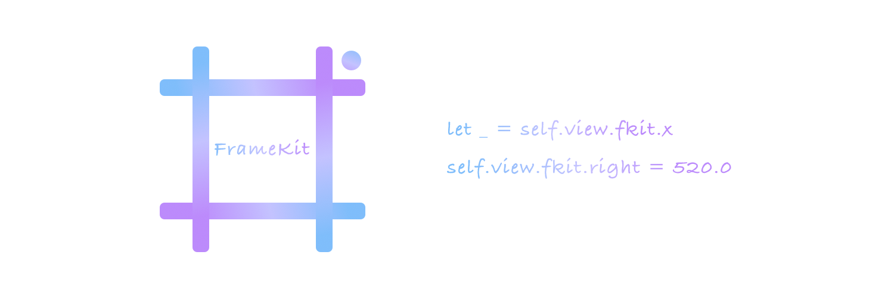

# FrameKit

    [](http://weibo.com/coderfish)




# 简介 

> [English Introduction](README.md)

**FrameKit 是一个链式调用的 UIView frame 工具**。

你是不是很厌倦这样的写法：

```swift
self.view.frame.origin = CGPoint(x: 100.0, y: self.view.frame.origin.y)
```

同时，不同的库对 frame 的扩展又会导致一些命名冲突。

如果使用 FrameKit，你的 frame 设置将会变成：

```swift
self.view.lpd.x = 100.0
```

你可以直接引入你的项目中，或者作为你个人库的依赖库，**FrameKit 将会很好的帮你减少代码量和命名冲突**，希望你喜欢 FrameKit。

# 安装

```
pod 'FrameKit'
```

# 示例调用

```swift
let _ = self.view.fkit.x
self.view.fkit.x = 0.0

let _ = self.view.fkit.right
self.view.fkit.right = 300.0

let _ = self.view.fkit.bottom
self.view.fkit.bottom = 300.0

let _ = self.view.fkit.centerX
self.view.fkit.centerX = 100.0
```

# 全部接口

```swift
extension UIView {
    public var fkit: FrameKit.UIViewExtension { get }
}
```

`get` `set` 均可

```swift
public var y: CGFloat

public var width: CGFloat

public var height: CGFloat

public var size: CGSize

public var centerX: CGFloat

public var centerY: CGFloat

public var top: CGFloat

public var bottom: CGFloat

public var left: CGFloat

public var right: CGFloat
```

# License

FrameKit 使用 [MIT License](LICENSE)

# 反馈

如果有什么修改建议，可以发送邮件到 <coderfish@163.com>，也欢迎到我的[博客](http://zhoulingyu.com)一起讨论学习哟~


